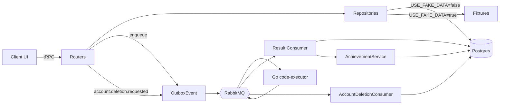

# CodeRoster Fullstack Overhaul

> 10 user-reported issues + cross-cutting design/faker hardening. Each numbered point below maps to dedicated todos. Modular boundaries per `clean-code` rule (one repo per domain, one router per domain, one feature folder per page).

## Architecture deltas



New domains: `sandbox`, `leaderboard`, `daily`, `weekly`, `achievement`, `account` (+ extends to `execution` for autotests).

Naming: PascalCase models, camelCase fields, RU UI strings, EN code symbols. All new pages = server component prefetch + `HydrateClient` + client subtree, frosted-glass cards using `bluredBg()` mixin and tokens from `variables.scss`.

## 0. Cross-cutting foundations

- **Strict faker gating** — `env.USE_FAKE_DATA` already drives `getAppRepositories()`. Add same flag to client via `next.config.js` -> `NEXT_PUBLIC_USE_FAKE_DATA` and a `<FakerOnly>` / `<RealOnly>` wrapper in `app/src/shared/components/system/FakerGate/`. Replace every demo-data link/button (e.g. `/u/codenikita` in `categories.ts:NAV_CATEGORIES` and `coming-soon/page.tsx`) with `FakerOnly`-gated render. When `false`, only real data; empty states use new `<EmptyState>` shared component.
- **Header viewer username** — `PlatformHeader.resolveViewer()` (`app/src/shared/components/layouts/PlatformShell/PlatformHeader/index.tsx:38`) drops email-prefix derivation; instead calls new `getOrSyncLocalUser(session)` thin wrapper around `UserSyncService.syncFromSession` and reads `user.username` from local DB. Eliminates 404s after nick change.
- **`/u/me` redirect** — new `app/src/app/(platform)/(standard)/u/me/page.tsx` server component: resolves session → DB user → `redirect('/u/' + user.username)`. UserMenu and any "Мой профиль" links use `/u/me` (stable through future renames).
- **Denormalized XP** — add `User.totalXp Int @default(0)` and `User.streakDays Int @default(0)`. Mutated by `XpService` on lesson.passed / course.finished / daily.cleared / weekly.cleared. Fixes `streakDays` always 0 in `profile.repository.ts:85`.
- **Modular service layer** — new folder `app/src/server/services/` with one class per concern: `XpService`, `AchievementService`, `StreakService`, `DailyChallengeService`, `WeeklyChallengeService`, `AccountDeletionService`, `LeaderboardService`. Routers stay thin; consumers/cron call services.

## 1. Settings — redesign

Replace Mantine `Tabs` shell with platform-styled module. Files affected:

- New `app/src/features/platform/settings/SettingsLayout/index.tsx` + `styles.module.scss` — vertical sidebar of section links + main content card; mobile = top accordion. Frosted-glass via `bluredBg()`, tokens only.
- New `app/src/features/platform/settings/sections/*Card/` for `ProfileCard`, `AccountCard`, `SocialsCard`, `AppearanceCard`, `DangerCard` — each standalone, prop-only, single-responsibility.
- Avatar preview (live) + URL input; bio counter (`max 400`); username regex hint inline; submit buttons disabled until dirty.
- Mobile breakpoints via PostCSS Mantine vars; sticky save bar on small viewports.
- Old `SettingsTabs` deleted; `app/src/app/(platform)/(standard)/settings/page.tsx` renders new `SettingsLayout`.

## 2. Settings — real account data

- Confirm Prisma path: `PrismaSettingsRepository.getMine` already maps `user.*`. Fix the **fake leakage**: when `USE_FAKE_DATA=false` and the local row is missing (first WorkOS login), call `UserSyncService.syncFromSession(ctx)` inside `createTRPCContext` so `ctx.user` always reflects DB state.
- `AccountCard` displays Email (read-only from `settings.getMine.email`), WorkOS-managed badge, joined-at date. Drop hard-coded fake email if any.
- Server `settings.getMine` extended to also return `joinedAt`, `role` — small Zod widening of `UserSettings`.

## 3. Settings — save actually persists

- Audit `settings.update` mutation chain: router → `idempotentProcedure` → `repositories.settings.update` → Prisma `db.user.update` (already wired). Add `revalidatePath('/u/' + updated.username)` and `await cache.del('profile:' + username)` to invalidate read-through cache.
- `ProfileCard` / `SocialsCard` / `AppearanceCard` use `api.settings.update.useMutation({ onSuccess: utils.settings.getMine.setData(...); notifications.show(...) })` — replace any `setData` only forms with explicit `await refetch()` to avoid stale UI.
- Add `username` uniqueness check error-mapping → friendly RU message.
- Add Mantine `notifications` success/error toast on every save.

## 4. Settings — delete account via broker

- New mutation `account.deleteMine` (protected, idempotent) in new router `app/src/server/api/routers/account.ts`. Writes `OutboxEvent` topic `account.deletion.requested` payload `{ userId, requestedAt }` in same TX as marking `User.deletionRequestedAt`. Returns `{ queued: true }` and UI redirects to `/account/logout`.
- New consumer `app/src/server/consumers/accountDeletion.ts` subscribed to `account.deletion.requested` queue. Calls new `AccountDeletionService.delete(userId)` which: anonymises comments (`authorId → null`-style or attribute), `db.user.delete` (cascades enrollments / attempts / activities / executions / tracks), drops Redis profile cache, emits `account.deletion.completed` for audit log.
- Compose: register new consumer alongside `result-consumer` in `docker-compose.yml`.
- UI: `DangerCard` confirmation modal ("введите username для подтверждения"), explicit copy on irreversibility.

## 5. /me profile → 404 fix

Already covered by §0: header now uses DB username, plus `/u/me` redirect handles stale links. Verification todo: cypress-style manual check (logged-in user visits `/u/me` → lands on own profile; rename in settings → still works).

## 6. Achievements page + engine

- New page `app/src/app/(platform)/(standard)/achievements/page.tsx` — grid of all achievements with progress bars (`currentN/goal`), category filters (Прогресс / Стрик / Скорость / Полнота / Скрытые), locked teasers for hidden ones.
- Backed by new procedure `achievement.listMine` (protected) and `achievement.listAll` (public, used by /achievements when guest viewing demo). Uses new `AchievementRepository`.
- **Engine** in `app/src/server/services/AchievementService.ts`:

```ts
type AchievementRule = {
  slug: string;
  trigger:
    | "lesson.passed"
    | "course.finished"
    | "streak.tick"
    | "daily.cleared"
    | "execution.completed";
  evaluate(ctx: EvalContext): Promise<{ delta: number; satisfied: boolean }>;
};
```

Registry registers one rule per achievement (open/closed: add new rule = no edit to engine).

- Hooked into:
  - `executionResult.ts` consumer on `passed: true` → trigger `lesson.passed`.
  - `progress.markComplete` mutation → trigger `lesson.completed`.
  - `enrollment.advance` finishing course → trigger `course.finished`.
  - `StreakService.tick` (called from daily cron + every lesson.passed) → trigger `streak.tick`.
  - `DailyChallengeService.recordSolve` → trigger `daily.cleared`.

- Seed (`prisma/seed.ts`) — extend with: `first-steps` (1 lesson), `on-fire` (7-day streak), `all-clear` (1 course finished), `speed-coder` (passed under 60s), `night-owl` (hidden, activity 00-04), plus add: `polyglot` (tasks in both Python and PHP), `marathon` (10 lessons in one day), `daily-grinder` (7 daily challenges cleared), `weekly-champion` (1 weekly challenge), `comeback` (return after 7-day pause). Each with `goal`, `category`, `rarity`, `hidden`.

## 7. Course task autotests + Run vs Submit

- **New Prisma model** in `app/prisma/schema.prisma`:

```prisma
model CourseTaskAutotest {
  id           String   @id @default(cuid())
  courseTaskId String
  order        Int      @default(0)
  name         String   @default("Тест")
  input        String?  // stdin (nullable per spec)
  expected     String   // expected stdout (trimmed match)
  hidden       Boolean  @default(false)

  task CourseTask @relation(fields: [courseTaskId], references: [id], onDelete: Cascade)

  @@unique([courseTaskId, order])
}
```

And `CourseTask.autotests CourseTaskAutotest[]`. Migration + seed entries for existing tasks.

- **Execution payload extension** in `app/src/shared/contracts/execution.ts` and Go mirror `workers/code-executor/internal/contracts/events.go`:

```ts
ExecutionRequested = {
  executionId, userId, taskId: string | null, language, code,
  mode: 'run' | 'submit',
  tests?: { name: string; input: string | null; expected: string; hidden: boolean }[]
}
```

- **Worker** (`workers/code-executor/internal/sandbox/runner.go`):
  - On `mode === 'run'` (or `tests` empty): execute once, return `passed: false` (semantically: not a graded run; UI distinguishes "запущено" vs "пройдено"); fill `stdout/stderr/runtimeMs/status`.
  - On `mode === 'submit'`: iterate over `tests`, for each run container with `input` piped to stdin, capture stdout, compare `strings.TrimSpace(stdout) == strings.TrimSpace(expected)`. Build `TestResult[]` with name/expected/actual/passed; overall `passed = all(testResults.passed)` — drop the false-positive `stdout != ""` heuristic in `runner.go:70-77` and `buildBaseTests`.

- **Router/repository**:
  - `execution.run` input gets `mode` enum and optional `taskId` (null for sandbox). Repository fetches autotests when `mode==='submit' && taskId` and embeds them into outbox payload.
  - Sandbox path always `mode='run'`, `taskId=null`.

- **Consumer** (`executionResult.ts`):
  - `mode='run'` → only persist execution row, no tryN, no markComplete, no achievement triggers.
  - `mode='submit' && passed` → upsert attempt with `tryN: { increment: 1 }`, set `status: SUCCESS`, advance enrollment, fire achievements.
  - `mode='submit' && !passed` → `tryN: { increment: 1 }`, attempt stays `ACTIVE`.

- **UI** (`InCourseShell/index.tsx`): two distinct buttons "Запустить" (mode=run) and "Проверить" (mode=submit). Output panel tabs: Output (run), Tests (submit), Errors. "Отметить готово" auto-disabled when `mode==='submit' && passed`; clicking it calls `progress.markComplete` (manual override path retained).

## 8. /sandbox page (minimal scope)

- New route `app/src/app/(platform)/(standard)/sandbox/page.tsx`.
- New feature folder `app/src/features/platform/sandbox/`: `SandboxShell`, `SandboxToolbar` (language picker Python/PHP, Run button), `SandboxEditor` (reuse `CodeEditor`), `SandboxOutput` (reuse `ExecutionPanel` rendering).
- Calls `execution.run` with `taskId: null, mode: 'run', language, code`. Polls `execution.get`. No tests, no XP.
- Updates `categories.ts` Песочница → `/sandbox`.

## 9. /leaderboard page (premium scope)

- New route `app/src/app/(platform)/(standard)/leaderboard/page.tsx`.
- New router `app/src/server/api/routers/leaderboard.ts` and `leaderboard.repository.ts`:
  - `leaderboard.global({ window: 'week'|'month'|'allTime', language?: 'python'|'php' })` → top 50 by `User.totalXp` (allTime) or by sum(`UserActivity.payload.xp`) within window. Cached 60s in Redis.
  - `leaderboard.byCourse({ courseSlug, window })` → enrollments-derived ranking by `progressPercent` then `finishedAt asc`.
- UI: `LeaderboardTabs` with three top-level tabs (Глобально / По курсу / По языку), nested `WindowSwitcher` (Неделя/Месяц/Всё время). Row: rank, avatar, username (link to `/u/<username>`), XP, badge.
- Mobile: collapses to a virtualised list.

## 10. /daily page (premium scope)

- New Prisma models:

```prisma
model DailyChallenge {
  id        String   @id @default(cuid())
  date      String   @unique // 'YYYY-MM-DD' UTC
  taskIds   String[]         // 3 CourseTask ids, mixed difficulty
  createdAt DateTime @default(now())
}

model DailyChallengeAttempt {
  id           String   @id @default(cuid())
  userId       String
  date         String   // FK -> DailyChallenge.date
  taskIndex    Int      // 0..2
  status       AttemptStatus @default(ACTIVE)
  executionId  String?
  solvedAt     DateTime?
  @@unique([userId, date, taskIndex])
}
```

- `DailyChallengeService.rollover()` cron at `0 0 * * *` UTC selects 3 random PUBLISHED tasks across difficulty buckets (1 beginner, 1 intermediate, 1 advanced).
- New router `daily.*`: `getToday`, `submit({ taskIndex, code, language })` (delegates to `execution.run` with `mode='submit'`).
- UI: `app/src/app/(platform)/(standard)/daily/page.tsx` — three task cards with status badges, opens task in same `InCourseShell` variant tagged `dailyMode`. On 3/3 clear: bonus XP, streak ++, achievement trigger. Streak ribbon on profile header.

## 11. /weekly page (premium scope)

- Mirror models `WeeklyChallenge` + `WeeklyChallengeAttempt` keyed by ISO week. Pool of 5 tougher tasks; expires Sunday 23:59 UTC. Bigger XP reward.
- Route `/weekly`, router `weekly.*`. Adds `weekly-champion` achievement trigger.

## 12. Mocks audit + faker discipline

- Repository: confirm every `Fake*Repository` in `app/src/server/repositories/` is reachable only when `USE_FAKE_DATA=true` (single switch in `index.ts:getAppRepositories`).
- Client: replace remaining demo-data references with `FakerOnly` wrapper:
  - `app/src/shared/components/layouts/PlatformShell/PlatformHeader/categories.ts` — `Профили` href under `FakerOnly` else `/u/me`.
  - `app/src/app/(platform)/(standard)/coming-soon/page.tsx` — second CTA (`/u/codenikita`) → `FakerOnly`.
  - Any hardcoded UI labels (`WEEKDAYS`, `LANGUAGES` etc.) stay — they are chrome.
- Empty states: introduce `<EmptyState title icon hint cta?>` and use on profile (no achievements yet, no comments yet, no enrollments), leaderboard (no users in window), daily (loading / not generated).

## 13. Design polish

- Redesign nav header with subtler frosted glass + accent underline; mobile drawer with category accordions.
- Profile header: bigger XP/level ring (SVG), streak flame visible only when `streakDays>0`, social icons row.
- All new pages adopt `bluredBg()`, `mainShadow()` mixins; tokens only; YandexSans throughout.
- Add scroll-restore for tabbed pages (settings, leaderboard) so route stays sticky.
- Mobile breakpoints standardised in `mixins.scss`: `sm 640`, `md 900`, `lg 1200`, `xl 1536`.

## Migration / rollout

1. Prisma migrations (autotests, daily, weekly, user xp/streak, deletionRequestedAt) → `prisma migrate dev`.
2. Seed extended fixtures + achievements + at least 5 tasks with autotests.
3. Worker rebuild (Go contracts updated) → `docker compose build code-executor`.
4. New consumers wired in `docker-compose.yml`.
5. `.env.example`: keep `USE_FAKE_DATA=false` as default for prod parity; document `NEXT_PUBLIC_USE_FAKE_DATA` mirror.
