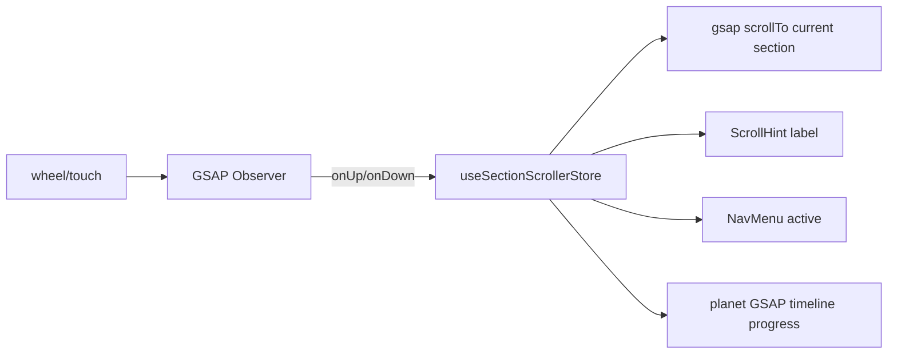

## 1. Build bug fixes (do first)

### 1a. Mantine packages missing

`[src/app/layout.tsx](frontend/src/app/layout.tsx)`, `[PureButton/index.tsx](frontend/src/shared/components/ui/buttons/PureButton/index.tsx)`, `[KeyboardBadge/index.tsx](frontend/src/shared/components/ui/KeyboardBadge/index.tsx)` and `[SearchSpotlightRoot/index.tsx](frontend/src/shared/components/ui/search/SearchSpotlightRoot/index.tsx)` import from `@mantine/core` / `@mantine/spotlight` but neither is in `[package.json](frontend/package.json)` and neither exists in `node_modules/@mantine`.

- `npm install @mantine/core @mantine/hooks @mantine/spotlight postcss-preset-mantine postcss-simple-vars` (versions matching Mantine 8 referenced in README).
- Update `[postcss.config.cjs](frontend/postcss.config.cjs)` to add `'postcss-preset-mantine': {}` and `'postcss-simple-vars': { variables: { 'mantine-breakpoint-xs': '36em', ... } }` alongside the existing `@tailwindcss/postcss` plugin.

### 1b. Sass `@import` deprecation across all `.module.scss`

All component `styles.module.scss` files start with `@import '~/shared/assets/styles/mixins'` (deprecated in Dart Sass 3). Migrate to module system:

- Add `_mixins.scss` partial (rename or alias) so it can be loaded via `@use`.
- Replace every offending `@import '...mixins...'` with `@use '~/shared/assets/styles/mixins' as *;` (keeps existing `@include buttonReset` calls working).
- Same for `[globals.scss](frontend/src/shared/assets/styles/globals.scss)` `@import './mixins'`.

(~22 files listed in terminal log.)

## 2. Snap section scroller (GSAP Observer)

### `~/features/home/components/common/SectionScroller/`

- New client component, wraps `<main>`. Uses `gsap.registerPlugin(Observer)` and creates `Observer.create({ type: 'wheel,touch,pointer', preventDefault: true, tolerance: 10, onUp: () => goToSection(current+1), onDown: () => goToSection(current-1) })`.
- Sections registered as `data-section` siblings; component does `gsap.to(window, { scrollTo: { y: section.offsetTop } })` with `power2.inOut` and a 1s lockout to prevent double-trigger.
- Stores active index + count in new `section-scroller.store.ts` (Zustand) so `[ScrollHint](frontend/src/features/home/components/common/ScrollHint/)` and `NavMenu` can react.
- Disable default scroll: `body { overflow: hidden }` only while scroller mounted (toggled in the component).
- Respects `prefers-reduced-motion` (skips snap, allows native scroll).



The existing planet `ScrollTrigger` keeps working because the component still does real `window` scroll — Observer only intercepts the wheel event and calls `scrollTo`.

## 3. Five sections + footer

Move existing inline JSX out of `[(home)/page.tsx](frontend/src/app/(home)/page.tsx)` into one component per section under `~/features/home/components/sections/` (folders already exist, currently empty). Each section is a `data-section` block with `min-height: 100svh`.

### 01 — `HeroSection/`

Existing hero markup moves here unchanged (planet position untouched).

### 02 — `BitterTruthSection/`

Repurposes existing `[DescriptionWithAnimationList](frontend/src/features/home/components/ui/DescriptionWithAnimationList/)` + `Angry`/`Rain` items. Adds section number `02 / ГОРЬКАЯ ПРАВДА` and h1, matching the figma typography pattern (`figma/image.png`). Cursor effect: `useCursorOutlineTarget` on each row.

### 03 — `WhatToDoSection/`

`решение — что же делать?` Three large stacked statements that animate in horizontally (GSAP timeline triggered when section becomes active via store). Each statement has a hover area showing a small video bubble preview using new `useCursorVideoTarget` hook (see §6).

### 04 — `HowToStartSection/`

Timeline of 4 steps (`StepCard/` already a folder). Vertical rail with animated dot connector; each step uses `useCursorArrowToTarget` so cursor becomes the directional arrow when hovering the next step.

### 05 — `FeaturesSection/`

Card grid matching `[figma/image.png](frontend/figma/image.png)` — icon top-left, title, body, optional `СКОРО` chip top-right. Uses `[FeatureCard/](frontend/src/features/home/components/ui/FeatureCard/)`. Icons from `@fortawesome/free-solid-svg-icons` (laptop-code, trophy, book-open, star). `useCursorOutlineTarget` per card. CTA `НАЧАТЬ БЕСПЛАТНО` button.

### 06 — `FooterSection/` (contact us)

Two-column layout: left = brand block + nav links + socials, right = `ContactForm` (name, email, message). Submit calls fetch to `/api/v1/contact`. Loading + success/error states inline (no toast lib required). Section also includes copyright row.

### Section number + header pattern (shared)

New shared `~/features/home/components/ui/SectionHeader/` renders `02 / ГОРЬКАЯ ПРАВДА` chip + h1 + optional subtitle, matching figma.

## 4. ScrollHint chip

`~/features/home/components/common/ScrollHint/index.tsx`:

- `position: fixed; bottom: 2em; left 50%`, frosted background (`@include bluredBg`), pill radius.
- Reads current/next section from `section-scroller.store`. Shows `Прокрутите · ${nextSectionLabel}` + chevron-down icon (Font Awesome).
- Hides when current section is last; fades out during snap animation.
- Avoids overlap with `NavMenu` (left side) by centering, and with planet by sitting above on z-index but below header.

## 5. Loading screen

`~/features/home/components/common/AppLoader/`:

- Full-screen `position: fixed; inset: 0`, sits above everything.
- Tracks a `useLoadingStore` with `progress (0-1)` and `isReady`. Increments come from:
  - `THREE.LoadingManager` (one shared manager passed to `Planet/` material/texture loaders → `onProgress` updates store).
  - Document `readyState === 'complete'`.
- UI: centred CodeRoster logo + thin 1px progress line growing 0-100% + percentage text + small "ПРОПУСТИТЬ" link bottom-right that sets `isReady = true`.
- When `isReady`, fades out 600ms then unmounts. SectionScroller + body-scroll-lock only enable after.
- Move planet's loaders to use this shared manager; pass it via prop to `[Planet/index.tsx](frontend/src/features/home/components/3d/models/Planet/)`.

## 6. Cursor extensions

Extend `[cursor.store.ts](frontend/src/features/home/components/common/Cursor/cursor.store.ts)`:

- Add `media: { type: 'image' | 'video' | null, src: string | null }` and `setMedia`/`resetMedia`.
- New cursor types: `'image'`, `'video'`.

Extend `[Cursor/index.tsx](frontend/src/features/home/components/common/Cursor/index.tsx)`:

- Conditionally render `` or `<video autoPlay muted loop>` inside cursor when `media.type` set.
- All transitions on `width/height/border-radius` use a 300ms cubic-bezier ease in `[styles.module.scss](frontend/src/features/home/components/common/Cursor/styles.module.scss)` so size/shape/media changes morph smoothly.

New hooks under `~/features/home/hooks/`:

- `useCursorImageTarget(ref, src)` — bubble cursor showing image (≈260×180, rounded).
- `useCursorVideoTarget(ref, src)` — same with autoplay video.

## 7. ROUTES.md (new)

`[frontend/ROUTES.md](frontend/ROUTES.md)` — single source of truth for outgoing API calls. Initial content:

```
## POST /api/v1/contact
Used in: src/features/home/components/sections/FooterSection/ContactForm
Request body: { name: string, email: string, message: string }
Response 200: { ok: true }
Response 4xx: { ok: false, error: string }
```

(Skeleton for future endpoints; updated as new fetch calls are added.)

## 8. Page composition

`[src/app/(home)/page.tsx](frontend/src/app/(home)/page.tsx)` becomes:

```
<HydrateClient>
  <AppLoader />
  <Cursor />
  <SearchSpotlight />
  <ClientPlanetSceneLoader />
  <Header />
  <NavMenu>...</NavMenu>
  <ScrollHint />
  <SectionScroller>
    <HeroSection />
    <BitterTruthSection />
    <WhatToDoSection />
    <HowToStartSection />
    <FeaturesSection />
    <FooterSection />
  </SectionScroller>
</HydrateClient>
```

## 9. Overlap / z-index audit

Single z-index scale in `variables.scss` (new `--z-cursor: 9999; --z-loader: 9000; --z-header: 1000; --z-nav: 800; --z-hint: 700; --z-planet: -1`). Update existing fixed components to use these tokens. Validates: `Header` (top), `NavMenu` (bottom-left), `ScrollHint` (bottom-center), `Cursor` (overlay), no overlap with content because all sections center their content with `padding-x: var(--padding-main)` and `max-width: var(--width-content)`.

## 10. Cleanup

- Delete the empty/unused mirror dirs (`components/layouts/FeaturesSection|HowToStartSection|WhatToDoSection|Footer`) — keep only `components/sections/...` and `components/common/Footer/...` if needed.

## 11. Verification (after implementation)

- Open browser at `http://localhost:3000/`, scroll-wheel through all 6 sections, confirm snap, hint label, planet animation, cursor media morphs, contact form posts to `/api/v1/contact` (network tab returns 404 expected — backend not built; UI shows error gracefully).
- `npm run check` clean.
