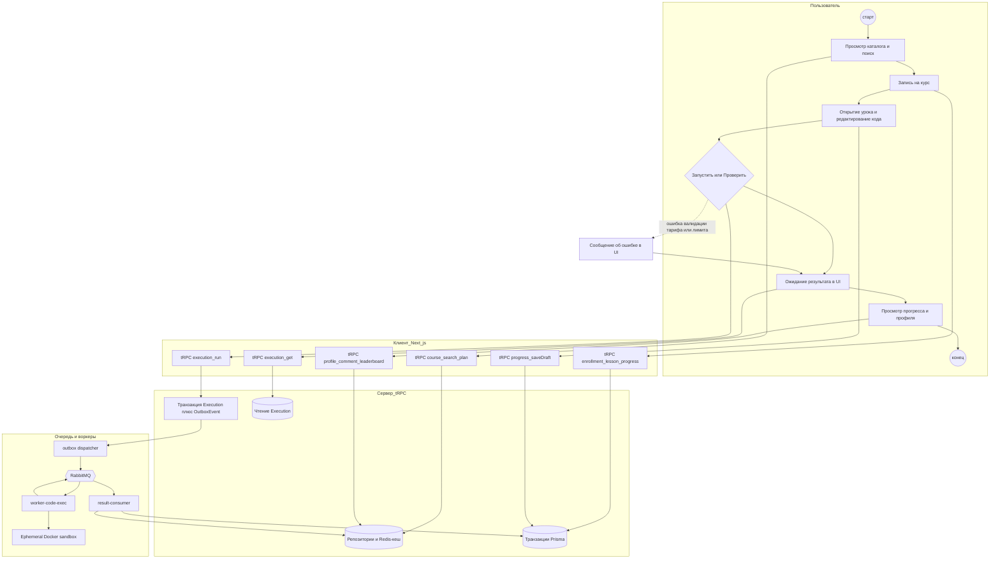
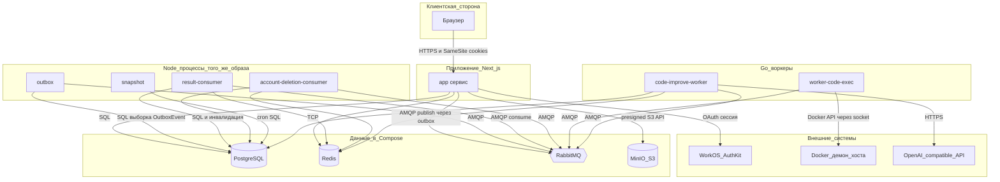
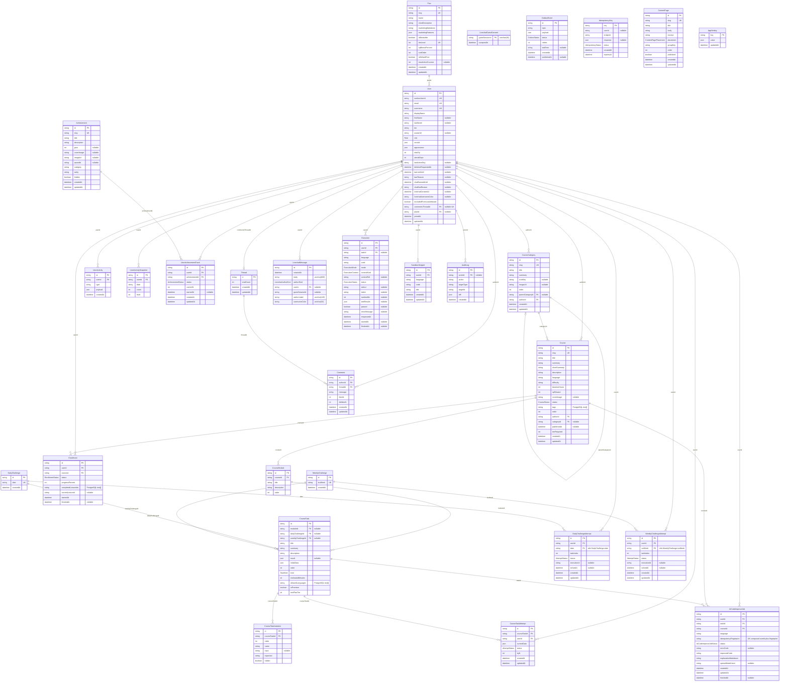

# Продуктовый анализ платформы «Кодиум» (CodeRoster)

Документ описывает структуру монорепозитория, доменные возможности, архитектурные паттерны, безопасность, авторизацию, асинхронное исполнение кода, админ-панель и конфигурацию окружения. Источники: код в каталоге [`app/`](../app/), корневой [`README.md`](../README.md), [`app/README.md`](../app/README.md), [`app/ROUTES.md`](../app/ROUTES.md), [`docker-compose.yml`](../docker-compose.yml), [`app/prisma/schema.prisma`](../app/prisma/schema.prisma).

---

## Оглавление

1. [Резюме продукта](#1-резюме-продукта)
2. [Структура репозитория](#2-структура-репозитория)
3. [Функциональность по доменам и API](#3-функциональность-по-доменам-и-api)
4. [Архитектурные паттерны](#4-архитектурные-паттерны)
5. [Исполнение кода и очереди](#5-исполнение-кода-и-очереди)
6. [Безопасность](#6-безопасность)
7. [Аутентификация и авторизация](#7-аутентификация-и-авторизация)
8. [Админ-панель](#8-админ-панель) ([возможности по разделам](#возможности-администратора-по-разделам))
9. [Оптимизация и кеширование](#9-оптимизация-и-кеширование)
10. [Конфигурация окружения](#10-конфигурация-окружения)
11. [Технологический стек (зависимости приложения)](#11-технологический-стек-зависимости-приложения)
12. [UML: взаимодействие ключевых фич](#12-uml-взаимодействие-ключевых-фич)
13. [UML: стек и взаимодействие сервисов](#13-uml-стек-и-взаимодействие-сервисов)
14. [UML: структура базы данных](#14-uml-структура-базы-данных)

---

## 1. Резюме продукта

**Кодиум** — образовательная платформа для обучения программированию через практику: интерактивные задания, автопроверка кода в изолированной среде, геймификация (XP, уровни, стрики, достижения), публичные профили и рейтинги. Философия продукта — упор на «делание», а не на пассивное потребление контента.

Основной пользовательский цикл:

1. Пользователь открывает каталог курсов (`course.*`), при необходимости записывается (`enrollment.*`).
2. В режиме прохождения (`lesson.*`) редактирует решение; черновик сохраняется (`progress.saveDraft`).
3. **Запустить** (`execution.run`, режим `run`) — предпросмотр без зачёта прогресса.
4. **Проверить** (`execution.run`, режим `submit`) — отправка автотестов во внешний воркер; после события `execution.completed` потребитель обновляет попытку, зачисление и активность; при успехе возможны начисления XP и достижения.

Параллельно доступны поиск (`search.global`), комментарии к профилю, livechat, тарифы (`plan.*`), песочница (`sandbox.*`), лидерборды (`leaderboard.*`), ежедневные и недельные челленджи (`daily.*`, `weekly.*`), ИИ-разбор кода (`codeImprove.*`) и админ-панель (`admin.*`).

---

## 2. Структура репозитория

| Путь                                                  | Назначение                                                                                                          |
| ----------------------------------------------------- | ------------------------------------------------------------------------------------------------------------------- |
| [`app/`](../app/)                                     | Next.js 15: UI (App Router), tRPC API, серверные репозитории, outbox-диспетчер, потребители RabbitMQ, джобы         |
| [`workers/code-executor/`](../workers/code-executor/) | Go: потребление `execution.requested`, запуск кода в ephemeral Docker-контейнерах, публикация `execution.completed` |
| [`workers/code-improve/`](../workers/code-improve/)   | Go: очередь `ai.code_improve.requested`, вызов OpenAI-совместимого API, запись в БД                                 |
| [`infra/`](../infra/)                                 | Dockerfiles, конфигурация RabbitMQ для Compose                                                                      |
| [`docker-compose.yml`](../docker-compose.yml)         | Полный dev-стек: Postgres, Redis, RabbitMQ, MinIO, приложение и фоновые сервисы                                     |

Подробная карта сервисов — в корневом [`README.md`](../README.md).

---

## 3. Функциональность по доменам и API

Маршрутизация процедур задаётся в [`app/src/server/api/root.ts`](../app/src/server/api/root.ts). Ниже — обзор подроутеров и типичных границ доступа (детали входов/выходов — в [`app/ROUTES.md`](../app/ROUTES.md)).

| Домен (роутер) | Назначение                                                                  | Доступ и ограничения                                                                              |
| -------------- | --------------------------------------------------------------------------- | ------------------------------------------------------------------------------------------------- |
| `course`       | Каталог: список с фильтрами, карточка курса                                 | Публичные запросы                                                                                 |
| `lesson`       | Контент урока/задачи для экрана обучения                                    | Публичные запросы                                                                                 |
| `enrollment`   | Статус записи, старт/отказ от курса                                         | `getMine` — публично (без сессии вернётся `null`); мутации — защищённые, идемпотентные            |
| `progress`     | Черновик кода, отметка урока выполненным                                    | Защищённые                                                                                        |
| `execution`    | Постановка в очередь исполнения, опрос статуса                              | `run` — `heavyProcedure` (идемпотентность + 10 вызовов/мин/пользователь); `get` — защищённый      |
| `profile`      | Публичный профиль, активность, достижения на странице пользователя          | Публичные запросы                                                                                 |
| `settings`     | Настройки аккаунта                                                          | Защищённые; `update` — идемпотентный                                                              |
| `comment`      | Лента комментариев профиля                                                  | Список — публично; `post` — идемпотентность + 5/мин/пользователь                                  |
| `search`       | Глобальный поиск по курсам, пользователям, урокам                           | Публично + 30/мин/IP                                                                              |
| `account`      | Статус аккаунта, асинхронное удаление через outbox                          | Защищённые; удаление — идемпотентное                                                              |
| `achievement`  | Каталог достижений и прогресс текущего пользователя                         | `listAll` — публично; `listMine` — защищённый                                                     |
| `sandbox`      | Сниппеты экспериментов в песочнице                                          | Защищённые; при `USE_FAKE_DATA` — ограничения                                                     |
| `leaderboard`  | Глобальный и по-курсовый рейтинг                                            | Публичные процедуры (логика фильтров — в сервисе)                                                 |
| `daily`        | Ежедневный челлендж, стрик                                                  | `getToday` — публично; `submit` — `heavyProcedure`; `myStreak` — защищённый                       |
| `weekly`       | Недельный челлендж                                                          | `getCurrent` — публично; `submit` — `heavyProcedure`                                              |
| `admin`        | CRUD каталога, редактор курса, модерация, аудит, тарифы, ИИ-настройки и др. | Все процедуры — `adminProcedure` + запись в `AuditLog`                                            |
| `upload`       | Presigned PUT в объектное хранилище                                         | Защищённые; виды загрузки для контента — только администратор                                     |
| `livechat`     | Сообщения, политики гостей, согласие                                        | Смесь публичных процедур с Redis rate-limit (`livechatReadProcedure`, `livechatSendProcedure`, …) |
| `plan`         | Список тарифов, текущий план пользователя, выбор плана                      | Список/политики — публично; `select` — защищённый идемпотентный                                   |
| `codeImprove`  | Запуск ИИ-задачи, опрос статуса; перегенерация для админа                   | `start` — `aiImproveProcedure`; часть методов — только админ                                      |

Централизованные строители процедур и ограничения определены в [`app/src/server/api/procedures.ts`](../app/src/server/api/procedures.ts).

---

## 4. Архитектурные паттерны

- **Next.js App Router**: страницы по умолчанию React Server Components; интерактивные острова — клиентские компоненты с TanStack Query и tRPC.
- **tRPC v11**: типобезопасный контракт между клиентом и сервером; эндпоинт [`/api/trpc`](../app/src/app/api/trpc).
- **Репозитории**: бизнес-доступ к данным инкапсулирован в интерфейсах [`app/src/server/repositories/`](../app/src/server/repositories/). Выбор реализации — в [`getAppRepositories()`](../app/src/server/repositories/index.ts): при `USE_FAKE_DATA=true` подставляются фикстуры, иначе Prisma.
- **Декораторы кеша**: для чтения «тяжёлых» доменов используются `CachedCourseRepository`, `CachedLessonRepository`, `CachedProfileRepository`, `CachedCommentRepository`, `CachedSearchRepository` поверх Prisma-реализаций.
- **Транзакционный outbox**: мутации, требующие надёжной доставки в брокер (исполнение кода, удаление аккаунта и др.), создают строки `OutboxEvent`; отдельный процесс публикует сообщения в RabbitMQ.
- **Фоновые процессы**: несколько контейнеров из одного образа приложения с разными entrypoints (`tsx` на файлы диспетчера и потребителей) плюс отдельные образы Go-воркеров — см. раздел [13](#13-uml-стек-и-взаимодействие-сервисов).

Контекст запроса создаётся в [`createTRPCContext`](../app/src/server/api/trpc.ts): Prisma-клиент, заголовки, бандл репозиториев и локальный пользователь после синхронизации с WorkOS.

---

## 5. Исполнение кода и очереди

1. Клиент вызывает `execution.run`. Сервер в одной транзакции создаёт запись `Execution` и `OutboxEvent` с темой `execution.requested` (см. [`app/src/shared/contracts/execution.ts`](../app/src/shared/contracts/execution.ts)).
2. Сервис [`outbox`](../app/src/server/outbox/dispatcher.ts) забирает события из Postgres (`FOR UPDATE SKIP LOCKED`), публикует в RabbitMQ с защитой circuit breaker.
3. [**worker-code-exec**](../workers/code-executor/) читает очередь, поднимает изолированный контейнер (Python или PHP по образам из переменных окружения), выполняет код с лимитами CPU, памяти, PID и таймаутом.
4. По завершении воркер публикует `execution.completed`.
5. [**result-consumer**](../app/src/server/consumers/executionResult.ts) обновляет `Execution`, попытку задачи, прогресс зачисления, активность и достижения, инвалидирует ключи Redis.

Режимы **`run`** и **`submit`** различаются на стороне потребителя: при `submit` подтягиваются автотесты, проверяется прохождение, продвигается обучение.

Отдельная цепочка: **ИИ-разбор кода** — топик `ai.code_improve.requested` ([`app/src/shared/contracts/aiCodeImprove.ts`](../app/src/shared/contracts/aiCodeImprove.ts)), воркер [`workers/code-improve/`](../workers/code-improve/).

Удаление аккаунта: топик `account.deletion.requested`, потребитель [`accountDeletion.ts`](../app/src/server/consumers/accountDeletion.ts).

---

## 6. Безопасность

- **Заголовки HTTP**: CSP, HSTS, ограничение фреймов и др. задаются в [`app/next.config.js`](../app/next.config.js) (см. также описание в [`app/README.md`](../app/README.md)).
- **XSS**: пользовательский Markdown и тексты проходят санитизацию (`sanitize-html`) на сервере перед сохранением.
- **Инъекции**: доступ к БД через Prisma с параметризацией; сырые запросы только через безопасные шаблоны.
- **Частота запросов**: Redis Lua fixed-window в [`app/src/server/rateLimit.ts`](../app/src/server/rateLimit.ts), подключение через middleware процедур.
- **Идемпотентность**: заголовок `idempotency-key` для повторяемых мутаций; ответ кешируется в `IdempotencyKey`.
- **Исполнение кода**: пользовательский код не выполняется в процессе Next.js — только во внешнем воркере внутри ограниченного контейнера Docker (`network none`, лимиты ресурсов, см. `.env.example`).
- **Загрузки файлов**: presigned URL, ограничение MIME и размера, разграничение прав администратора для «тяжёлых» типов ([`upload.ts`](../app/src/server/api/routers/upload.ts)).

---

## 7. Аутентификация и авторизация

- **Провайдер**: WorkOS AuthKit ([`@workos-inc/authkit-nextjs`](../app/package.json)); callback и middleware описаны в [`app/README.md`](../app/README.md).
- **Локальный пользователь**: [`UserSyncService`](../app/src/server/services/UserSyncService.ts) создаёт/обновляет строку `User` в Postgres по данным сессии WorkOS. При `USE_FAKE_DATA` контекст упрощается без обращения к БД.
- **`protectedProcedure`**: требует непустой `ctx.user`; заблокированные пользователи (`bannedUntil` в будущем, не админы) получают `FORBIDDEN` ([`trpc.ts`](../app/src/server/api/trpc.ts)).
- **`adminProcedure`**: роль `ADMIN` + аудит успешных мутаций.
- **Bootstrap администратора**: переменная окружения `ADMIN_BOOTSTRAP_EMAIL` в [`.env.example`](../.env.example); совпадение email при первой синхронизации выдаёт роль администратора.
- **Маршруты**: [`middleware.ts`](../app/src/middleware.ts) разделяет публичные и защищённые пути; забаненные перенаправляются на `/banned`.

---

## 8. Админ-панель

- **Доступ**: только пользователи с ролью `ADMIN`. Точка входа в UI — префикс `/admin` (группа маршрутов `(admin)` в [`app/src/app/(admin)`](<../app/src/app/(admin)>)). В шапке платформы пункт «Админ-панель» показывается при `role === 'ADMIN'`.
- **API**: все процедуры под [`admin.*`](../app/src/server/api/routers/admin/index.ts) строятся на [`adminProcedure`](../app/src/server/api/procedures.ts): это защищённая сессия WorkOS + проверка роли администратора + запись успешных **мутаций** в таблицу `AuditLog` ([`schema.prisma`](../app/prisma/schema.prisma)). Запросы на чтение (`query`) в журнал не попадают.

### Возможности администратора по разделам

Ниже перечислено, что администратор **видит**, **создаёт**, **редактирует** и **удаляет** в каждом подразделе панели. Имена процедур соответствуют вызовам tRPC (`admin.<namespace>.<method>`).

#### Дашборд (`/admin`)

- **Видит** агрегированные числа без отдельного tRPC-запроса: всего пользователей и сколько из них с активным баном по платформе; всего курсов и сколько в статусе черновика; всего задач (`CourseTask`) по всем модулям; контент-страниц; достижений в каталоге; опубликованных комментариев ([`app/src/app/(admin)/admin/page.tsx`](<../app/src/app/(admin)/admin/page.tsx>)).

#### Пользователи (`admin.users`)

- **Видит** постраничный список с фильтрами: поисковая строка `q`, фильтр по роли (`LEARNER` / `AUTHOR` / `MODERATOR` / `ADMIN`), фильтр по бану (`all` / `banned` / `active`), курсорная пагинация.
- **Видит** карточку пользователя по `id`: профильные данные, роль, баны, план и т.д.
- **Меняет** через `update` частичным патчем: отображаемое имя, никнейм (`username`), email, роль, био, URL аватара, **ручные** `totalXp` и `streakDays`, флаг **«исключить из лидерборда»** (`excludedFromLeaderboard`), назначение **тарифа** (`planId` или сброс на дефолтный бесплатный через `null`). Ограничение: администратор **не может** через эту форму снять с **себя** роль `ADMIN` (останется `LEARNER` в патче — запрос отклонится).
- **Бан платформы**: выставить `bannedUntil` (конкретная дата-время или «навсегда») и текст причины; **снять** бан (`unban`). Нельзя забанить **самого себя**.
- **Модерация чата**: отдельные `chatMute` / `chatUnmute` с тем же форматом «до когда» и причиной; нельзя замутить себя.
- **Достижения пользователя**: выдать достижение (`grantAchievement`), отозвать (`revokeAchievement`), просмотреть статусы треков (`listAchievementStatus`).
- **Видит** ленту активности пользователя с курсором (`listActivity`).
- **Удаляет** отдельную запись активности (`deleteActivity`).
- **Видит** комментарии пользователя с курсором (`listComments`) — для модерации в контексте профиля.

Реализация: [`app/src/server/api/routers/admin/users.ts`](../app/src/server/api/routers/admin/users.ts).

#### Каталог: категории (`admin.catalog.categories`)

- **Видит** дерево/список категорий.
- **Создаёт** категорию: `slug`, заголовок, краткое описание, опционально `iconKey`, картинка `imageUrl`, родитель `parentCategoryId`, порядок `order`.
- **Редактирует** любые из этих полей частичным патчем.
- **Удаляет** категорию.
- **Меняет порядок** отображения списком идентификаторов (`reorder`).

#### Каталог: курсы (`admin.catalog.courses`)

- **Видит** список курсов с фильтрами: строка поиска, статус (`DRAFT` / `PUBLISHED` / `HIDDEN`), категория, курсорная пагинация.
- **Создаёт** курс с минимальным набором: `slug`, заголовок; автором записывается текущий администратор.
- **Удаляет** курс.
- **Меняет статус** публикации (`setStatus`).
- **Меняет порядок** курсов в каталоге (`reorder`).

Реализация: [`app/src/server/api/routers/admin/catalog.ts`](../app/src/server/api/routers/admin/catalog.ts).

#### Редактор курса (`admin.courseEditor`, `/admin/courses/[id]`)

- **Видит** дерево курса: модули и задачи (`get`).
- **Редактирует метаданные курса** (`updateCourse`): слаг, названия и описания, язык, сложность, длительность в часах, награда XP, обложка (`coverImage`), категория, теги, **минимальный тариф для доступа** (`tierRequired`).
- **Модули**: создать (`module.create`), переименовать/описание (`module.update`), удалить (`module.delete`), изменить порядок (`module.reorder`).
- **Задачи внутри модуля**: создать (`task.create`, тип по умолчанию или `THEORY` / `TASK` / `QUIZ`), править контент и параметры (`task.update`: заголовок, описание, вид, минуты, **разрешённые языки**, стартовые данные, результат для квиза, флаги **премиум** и `minPlanTier`), удалить, упорядочить.
- **Автотесты задачи** (`autotest.*`): создать тест (имя, stdin `input`, ожидаемый `expected`, скрытый ли тест), править, удалить, упорядочить — те же сущности `CourseTaskAutotest`, что использует проверка решений.

Реализация: [`app/src/server/api/routers/admin/courseEditor.ts`](../app/src/server/api/routers/admin/courseEditor.ts).

#### Контент-страницы (`admin.contentPages`, Markdown CMS для `/p/[slug]`)

- **Видит** список всех страниц и одну страницу по `id`.
- **Создаёт** страницу: `slug`, заголовок, тело Markdown (`body`), отрывок, **размещение** (`FOOTER` / `HEADER` / `HIDDEN`), группа колонок футера (`groupKey`), порядок, флаг публикации.
- **Редактирует** поля частичным патчем, **удаляет** страницу.
- **Включает/выключает публикацию** отдельной мутацией (`setPublished`).
- **Меняет порядок** страниц (`reorder`). Опубликованные страницы с `placement = FOOTER` участвуют в колонках подвала платформы.

Реализация: [`app/src/server/api/routers/admin/contentPages.ts`](../app/src/server/api/routers/admin/contentPages.ts).

#### Достижения — каталог (`admin.achievements`)

- **Видит** список и карточку достижения.
- **Создаёт** и **редактирует**: слаг, название, описание, категория, редкость, скрыто ли из каталога (`hidden`), числовая цель (`goal`), иконка (`coverImage`), загружаемая картинка (`imageUrl`), произвольный `awardId`.
- **Удаляет** достижение из каталога.

Реализация: [`app/src/server/api/routers/admin/achievements.ts`](../app/src/server/api/routers/admin/achievements.ts).

#### Дейлики и недельные челленджи (`admin.challenges`)

Структура зеркалит редактор курса, но задачи привязаны к **дате** (`YYYY-MM-DD`) или **ISO-неделе** (`YYYY-Www`), а не к модулю.

- **Ежедневные**: список и карточка челленджа; **создать** на дату; **удалить**; для задач — create / update / delete / reorder (поля как у задачи курса: тип, описание, языки, премиум, автотесты и т.д.).
- **Еженедельные**: то же для недели `isoWeek`.
- **Автотесты** вынесены в общий подроутер `admin.challenges.autotest` (те же записи `CourseTaskAutotest`, что и у задач курсов).

Реализация: [`app/src/server/api/routers/admin/challenges.ts`](../app/src/server/api/routers/admin/challenges.ts).

#### Лидерборд (`admin.leaderboard`)

- **Видит** рейтинг участников (опционально с фильтром по языку программирования для админского обзора).
- **Меняет** флаг «исключить из рейтинга» для пользователя (`setExclusion`) — дублирует и дополняет правку того же поля в карточке пользователя.

Реализация: [`app/src/server/api/routers/admin/moderation.ts`](../app/src/server/api/routers/admin/moderation.ts).

#### Комментарии — глобальная модерация (`admin.comments`)

- **Видит** таблицу всех комментариев с поиском `q` и курсором.
- **Удаляет** комментарий по `id` (в том числе в цепочках профиля и курсов).

#### Языки программирования (`admin.languages`)

- **Видит** текущий список разрешённых языков (хранится в `AppSetting`, используется при выборе языков в задачах).
- **Заменяет** весь список массивом строк (`update`) — администратор задаёт глобальный перечень (например `python`, `php`).

Реализация: [`app/src/server/api/routers/admin/languages.ts`](../app/src/server/api/routers/admin/languages.ts).

#### Аудит (`admin.audit`)

- **Видит** **только чтение** журнал `AuditLog`: фильтры по актору (`actorId`), типу цели (`targetType`), id цели (`targetId`), курсорная пагинация. Каждая успешная админ-мутация порождает запись с полезной нагрузкой (`diff`).

Реализация: [`app/src/server/api/routers/admin/audit.ts`](../app/src/server/api/routers/admin/audit.ts).

#### Живой чат (`admin.livechat`)

- **Видит** текущую политику: могут ли **гости** писать в чат без полноценной регистрации (`getGuestPolicy`).
- **Меняет** переключатель «гости могут писать» (`setGuestPolicy`). Детальная модерация отдельных пользователей в чате — через **баны чата** в разделе пользователей.

Реализация: [`app/src/server/api/routers/admin/livechat.ts`](../app/src/server/api/routers/admin/livechat.ts).

#### Тарифы (`admin.plans`, `/admin/plans`)

- **Видит** список планов подписки (`Plan`).
- **Создаёт** план: слаг, имя, краткое описание, **уровень тарифа** `tierLevel` (уникален), процент бонуса к XP, порядок сортировки, лимит одновременных активных курсов (`maxActiveCourses`, `null` — без лимита), флаг дефолтного бесплатного плана, маркетинговые поля (`marketingMarkdown`, список фич `marketingFeatures`), бейдж «хит» (`isBestseller`).
- **Редактирует** план частичным патчем (включая смену `slug`/`tierLevel` с проверкой уникальности).
- **Назначает** какой план считается **бесплатным по умолчанию** для новых пользователей (`setDefaultFree`).
- **Отмечает «бестселлер»** (`setBestseller`) или **снимает** отметку (`clearBestseller`).

Сочетается с продуктовым флагом `SELF_SERVE_PLANS`: при `false` пользователи не смогут сами выбирать платные тарифы на клиенте — назначение остаётся за администратором ([`.env.example`](../.env.example)).

Реализация: [`app/src/server/api/routers/admin/plans.ts`](../app/src/server/api/routers/admin/plans.ts).

#### ИИ: разбор кода (`admin.aiCodeImprove`, `/admin/ai-code-improve`)

- **Видит** сохранённую настройку (JSON в `AppSetting`), в частности имя **OpenAI-совместимой модели**.
- **Обновляет** модель строкой `model` (используется Go-воркером [`code-improve-worker`](../workers/code-improve/) при обработке очереди `ai.code_improve.requested`).

Реализация: [`app/src/server/api/routers/admin/aiCodeImprove.ts`](../app/src/server/api/routers/admin/aiCodeImprove.ts).

Дополнительно процедура **`codeImprove.regenerateLatest`** помечена как staff-only (`adminProcedure`): она сбрасывает и снова ставит в очередь последнюю завершённую ИИ-джобу для пары `taskId` + `language`, но в коде фильтр по владельцу джобы использует **`userId` текущей сессии** ([`codeImprove.ts`](../app/src/server/api/routers/codeImprove.ts)), то есть на практике затрагивает джобы того аккаунта, под которым выполнен вход (уточнять поведение при развитии админ-UX).

#### Загрузки файлов (не под `admin.*`, но только для админского контента)

Через [`upload.createIntent`](../app/src/server/api/routers/upload.ts) администратор может получить presigned URL для видов **`COURSE_COVER`**, **`ACHIEVEMENT_COVER`**, **`CONTENT_PAGE_INLINE`**; обычные пользователи — только **`AVATAR`**.

---

## 9. Оптимизация и кеширование

- **Redis**: единый клиент [`app/src/server/redis.ts`](../app/src/server/redis.ts); обёртки [`cache.ts`](../app/src/server/cache.ts) для read-through и инвалидации префиксов.
- **Декораторы** на домены курс / урок / профиль / комментарий / поиск — см. [`repositories/index.ts`](../app/src/server/repositories/index.ts).
- **Снимки активности**: сервис [`snapshot`](../docker-compose.yml) запускает [`activitySnapshot.ts`](../app/src/server/jobs/activitySnapshot.ts) по cron (`ACTIVITY_SNAPSHOT_CRON`), агрегируя `UserActivity` в `UserActivitySnapshot` для быстрого теплокарта профиля.

---

## 10. Конфигурация окружения

Ключевые переменные описаны в [`.env.example`](../.env.example) и пробрасываются в [`docker-compose.yml`](../docker-compose.yml):

| Группа               | Примеры переменных                                                                                                         |
| -------------------- | -------------------------------------------------------------------------------------------------------------------------- |
| Брокер и БД          | `DATABASE_URL`, `REDIS_URL`, `RABBITMQ_URL`                                                                                |
| Auth                 | `WORKOS_API_KEY`, `WORKOS_CLIENT_ID`, `WORKOS_COOKIE_PASSWORD`, `NEXT_PUBLIC_WORKOS_REDIRECT_URI`, `WORKOS_COOKIE_MAX_AGE` |
| Режимы данных        | `USE_FAKE_DATA`, `NEXT_PUBLIC_USE_FAKE_DATA`                                                                               |
| Планы                | `SELF_SERVE_PLANS`, `NEXT_PUBLIC_SELF_SERVE_PLANS`                                                                         |
| Песочница исполнения | `WORKER_PYTHON_IMAGE`, `WORKER_PHP_IMAGE`, `EXECUTION_*`, `IMAGE_PULL_TIMEOUT_MS`                                          |
| Объектное хранилище  | `S3_ENDPOINT`, `S3_PUBLIC_URL`, `S3_BUCKET`, ключи доступа                                                                 |
| ИИ                   | `AI_CODE_IMPROVE_*`                                                                                                        |
| Прочее               | `SANITIZE_MARKDOWN`, `SKIP_ENV_VALIDATION` (Compose для dev), `ADMIN_BOOTSTRAP_EMAIL`                                      |

Валидация переменных для приложения — через **T3 Env** ([`app/package.json`](../app/package.json), модуль `~/env`).

---

## 11. Технологический стек (зависимости приложения)

Ниже — сжатая карта основных npm-зависимостей из [`app/package.json`](../app/package.json).

| Слой          | Библиотека                                                                                | Роль                                       |
| ------------- | ----------------------------------------------------------------------------------------- | ------------------------------------------ |
| Framework     | `next`, `react`, `react-dom`                                                              | App Router, UI                             |
| API           | `@trpc/server`, `@trpc/client`, `@trpc/react-query`, `@tanstack/react-query`, `superjson` | Контракт API и кеш на клиенте              |
| Данные        | `@prisma/client`, `prisma`                                                                | ORM и миграции                             |
| Auth          | `@workos-inc/authkit-nextjs`                                                              | Сессии WorkOS                              |
| Очередь       | `amqplib`                                                                                 | RabbitMQ                                   |
| Кеш           | `ioredis`                                                                                 | Redis                                      |
| Хранилище     | `@aws-sdk/client-s3`, `@aws-sdk/s3-request-presigner`                                     | S3-совместимые загрузки                    |
| UI            | `@mantine/*`, `@radix-ui/*`, `@fortawesome/*`, `lucide-react`                             | Компоненты и иконки                        |
| Редактор      | `@monaco-editor/react`, `monaco-editor`                                                   | Код в браузере                             |
| 3D / анимации | `three`, `@react-three/fiber`, `@react-three/drei`, `gsap`                                | Лендинг и эффекты                          |
| Контент       | `react-markdown`, `remark-gfm`, `@tiptap/*`                                               | Markdown и редактор                        |
| Валидация     | `zod`                                                                                     | Входные схемы tRPC и env                   |
| Прочее        | `sanitize-html`, `node-cron`, `openai`, `recharts`, `zustand`, `@dnd-kit/*`               | Санитизация, cron, графики, состояние, DnD |

Воркеры вне Node: **Go 1.23+** для исполнителя кода и ИИ-воркера (см. каталоги [`workers/`](../workers/)).

---

## 12. UML: взаимодействие ключевых фич

Диаграмма в стиле дорожек (**Пользователь → Клиент → Сервер и инфраструктура**) показывает сквозной сценарий прохождения задачи с асинхронным исполнением кода. Узлы используют технические имена процедур и сервисов для однозначной трассировки к коду.

**Легенда:** проверки тарифа премиум-задачи, rate-limit и идемпотентности выполняются до записи в Postgres; при ошибке очередь не задействуется, клиент показывает ответ tRPC.

---

## 13. UML: стек и взаимодействие сервисов

Диаграмма отражает контейнеры из [`docker-compose.yml`](../docker-compose.yml) и внешние системы. Пользовательский код выполняется только в контейнерах, которые создаёт **worker-code-exec**, а не внутри сервиса `app`.

---

## 14. UML: структура базы данных

Схема соответствует [`app/prisma/schema.prisma`](../app/prisma/schema.prisma). Ниже одна диаграмма **со всеми моделями**: у каждой сущности перечислены **все поля** и типы в нотации, согласованной с Prisma (PostgreSQL). Смысловые типы:

- `string`, `int`, `boolean`, `datetime`, `json` — скаляры Prisma `String`, `Int`, `Boolean`, `DateTime`, `Json`.
- Массивы Prisma `String[]` на диаграмме заданы как `string` с комментарием `PostgreSQL text[]` (в Mermaid для полей нет отдельного типа массива).
- Имена вроде `Role`, `CourseStatus`, `TaskKind` — перечисления Prisma (`enum`), хранятся в Postgres как перечисление/строка по версии миграций.
- Пометки **PK** / **FK** / **UK** — первичный ключ, внешний ключ, уникальность. Текст `"nullable"` — опциональное поле (`?` в схеме).

Инвариант **`CourseTask`**: ровно один из `moduleId`, `dailyChallengeId`, `weeklyChallengeId` задан; это не выражено CHECK в Prisma и соблюдается в коде репозиториев.

**Примечания:**

- Составной уникальный ключ `AiCodeImproveJob`: `(userId, idempotencyFingerprint)` — у поля `idempotencyFingerprint` в блоке сущности указано пояснение в кавычках.
- Связи **`DailyChallengeAttempt.date`** и **`WeeklyChallengeAttempt.isoWeek`** в Prisma ссылаются на естественные ключи `DailyChallenge.date` и `WeeklyChallenge.isoWeek` (не на суррогатный `id`).
- Таблицы **`OutboxEvent`** и **`IdempotencyKey`** не имеют FK на `User` в схеме Prisma; опциональный `userId` в `IdempotencyKey` — просто строка для учёта (см. разделы [5](#5-исполнение-кода-и-очереди) и [6](#6-безопасность)).
- **`LivechatGuestConsent`** не связана с `User`.

---

## Связанные артефакты планирования

Исторические планы реализации backend и fullstack-переделки содержат дополнительные Mermaid-черновики и чеклисты: [backend_implementation_cd831a8d.plan.md](../.cursor/plans/backend_implementation_cd831a8d.plan.md), [coderoster_fullstack_overhaul_776b41dd.plan.md](../.cursor/plans/coderoster_fullstack_overhaul_776b41dd.plan.md). Документ о секциях главной страницы при необходимости трактовать как дорожную карту UX: [home_page_sections_7179b7e6.plan.md](../.cursor/plans/home_page_sections_7179b7e6.plan.md).

---

_Документ сгенерирован для навигации по кодовой базе и продуктовой архитектуре; при изменении схем или сервисов его следует обновлять вручную или повторным прогоном анализа._
